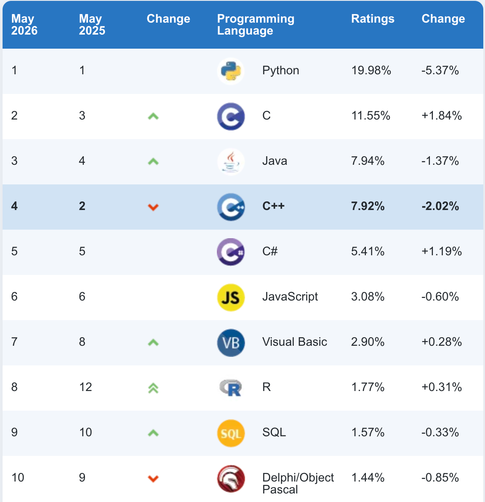
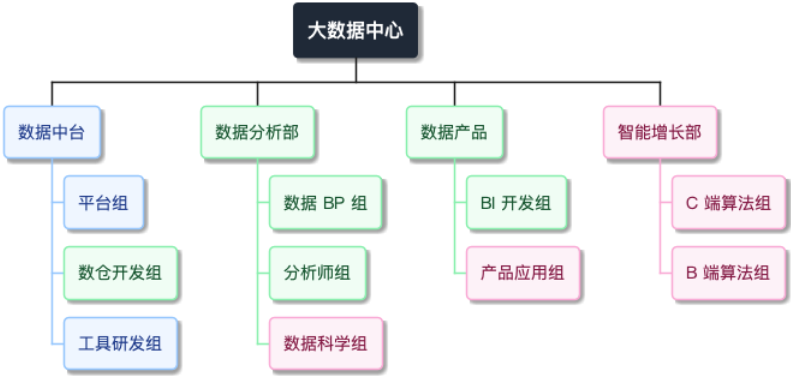
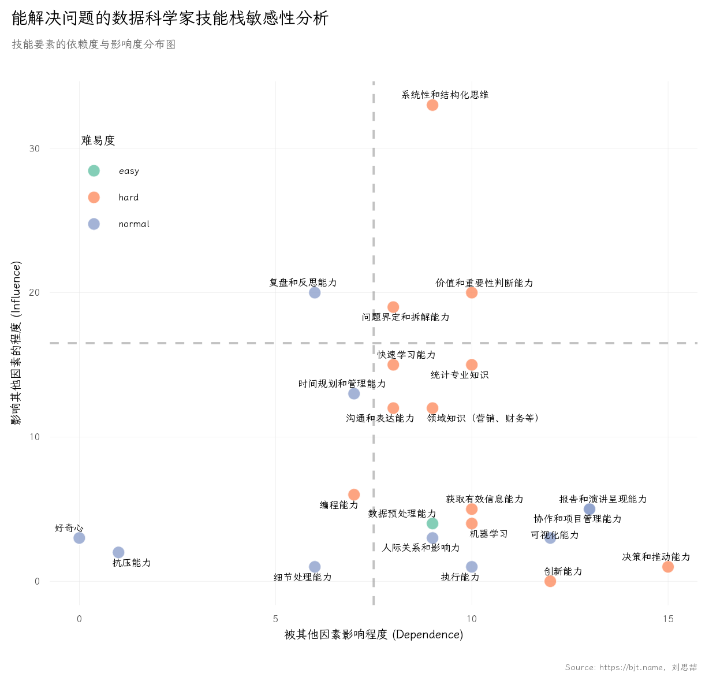

class: middle

.large[大纲]

<hr>

1. 技术演进与资本变化

2. 对统计人才的真实需求

3. 替代危机与跨学科挑战

4. 资源、优势与短板

5. 错位竞争与机会点

6. AI 原生时代的统计学家

7. 建议的策略

<hr>

???
各位老师、同仁，下午好。我今天汇报的题目是《AI 原生时代的统计学家：产业视角的技能演进与教学重构》。我不是高校教师，而是一直在产业一线做数据科学和工程落地。今天想从一个产业从业者的角度，聊聊当 AI 从一个科研工具变成基础设施，统计学这门学科及其培养的人才正在经历什么。这个视角可能和学术界的有些不同，希望能给大家带来一些启发。

今天的内容分为7个部分。前3个部分"看清现状"，中间3个聊"我们的位置"，最后2个谈"怎么行动"。整个逻辑从外部环境到内部审视，再到行动建议。

---
class: summary-gray, middle, center
count: false

## 技术演进与资本变化

---

## 技术演进的四条主线

.pull-left[

**1.从抽样推断到全样本分析**

统计学正从传统抽样推断，全面转向基于大数据和大算力的全样本分析。

**2.从判别式到生成式世界模型**

模型的终局正从单纯的判别式，向 JEPA、RSSM 等生成式"世界模型"演进。

]

.pull-right[

**3.Vibe Coding 重塑技能树**

AI 工具包揽基础代码实现，编程语言门槛被极大削弱。核心壁垒从"如何写代码"转向"如何进行架构设计与价值逻辑验证"。

**4.工具链大一统**

Hadley Wickham（tidyverse）与 Wes McKinney（pandas）同聚 Posit（前 RStudio），预示着数据科学工具链的大一统与语言边界的消融。

]

???
四条主线。第一，从抽样到全样本--抽样理论在产业界很多场景下被大算力消解。第二，生成式世界模型--模型需要理解世界如何运作。第三，Vibe Coding--编程不再是核心竞争力，架构设计和判断力才是。第四，tidyverse 和 pandas 的作者在同一家公司，工具链层面的融合正在发生。

---
class:middle

TIOBE CEO Paul Jansen 称，统计编程语言正经历一场重大洗牌。Python 和 R 成为最大的赢家。统计计算领域曾被众多小众语言和平台割裂的时代，即将落幕。

.img55[

]

MATLAB 即将跌出前 20 名，SAS 即将首次跌出前 30 名，
Mathematica 的市场份额仍远低于历史峰值，并且还在进一步下滑，SPSS 上个月跌出了前 100 名，S 也即将跌出前 100 名，Stata 目前排名第 124 位。

---
## 资本变化的四个信号

- **头部大厂对 AI 高级人才需求增加** -- 特别是懂底层架构和商业逻辑的人才。

- **垂直行业需要 AI 全链路赋能** -- 制造业、农业、医疗……每个细分领域都在呼唤数据和 AI 的渗透。

- **"计算增长"时代来临** -- 资本不再为单纯的"数字化基建"买单，而是要求数据直接挂钩企业的营收增长引擎与量化策略。

- **Token 经济学与算力资产化** -- 算力成为一种可定价、可交易的生产资料。

<br>

.alert[
核心变化：数据从"成本中心"变为"利润中心"，统计学家必须理解商业。
]

???
资本端的核心变化：数据从成本中心变成利润中心。老板不再为搞一套漂亮的数据平台买单，而是问"这个数据项目对我的营收增长有多少贡献？"

---
class: summary-gray, middle, center
count: false

## 对统计人才的真实需求

---

## 中心型数据组织架构（示例）

.img80[

]

- 数据中台：<span style="border: 1px solid #93C5FD; background-color: #EFF6FF; padding: 0px 0px; color: #1E3A8A;">技术</span>能力部门，面向数据
- 数据/商业分析：面向结论，管理层、<span style="border: 1px solid #86EFAC; background-color: #F0FDF4; padding: 0px 0px; color: #14532D;">业务</span>线等
- 数据产品：工具落地，协同技术部门和<span style="border: 1px solid #86EFAC; background-color: #F0FDF4; padding: 0px 0px; color: #14532D;">业务</span>部门
- 智能增长：<span style="border: 1px solid #F9A8D4; background-color: #FDF2F8; padding: 0px 0px; color: #831843;">增长</span>问题，直接面向价值

.footnote[数据 BP：Data Business Partner，借鉴了人力资源领域 HRBP 的成功经验，旨在解决数据团队与业务部门“两张皮”的问题]
---
## 企业需要什么样的人？

.column-2.column-norule[
.paradigm-old[

不再需要：

- 只会 SQL 没有想法，只能被动的接需求的提数工程师

- 只会做 T 检验和方差分析的"统计学家"

- 只会用 Excel 处理传统表格型数据的“数据分析师”

- 只会调包调参的"调参侠"

- 只懂统计不懂业务的"纯技术派"

- 只会写报告不会落地的"纸上分析师"

]

.paradigm-new[

真正需要：

- 懂**业务逻辑**，能把模糊的商业问题转化为精确的数据问题

- 能够处理**非结构化数据**（文本、图像、日志）的数据科学家

- 能推断也能写 API；懂统计也懂系统设计

- 能走通 "业务拆解 - 算力与数据资源评估 - 算法实现 - 商业决策交付/数据应用部署" 的**完整闭环**

- 适应 3-5 人的小团队作战，一人能撑起一条数据流水线。
]
]

???
企业端的需求已经发生了根本变化。如果你只会做 T 检验和方差分析，在今天的就业市场上几乎没有议价权。企业需要的是能把一个模糊的商业问题--"为什么用户留存下降了"--转化成可以量化的数据问题，然后从头到尾解决掉的人。这个闭环能力是当前统计教育最薄弱的环节。


---
## 价值创造的演进

#### 洞察 < 工具 < 流程 < 组织 < 模式

.pull-left[

**洞察 (Insight)：**

- 价值的“种子”
- 精准定位市场洼地与真实痛点
- 解决“做什么”与“为什么做”

**工具 (Tools)：**

- 价值的“单点杠杆”
- 单兵作战能力的极值
- 高门槛，依赖超级个体的发挥

**流程 (Process)：**

- 价值的“线性复制”
- 将个体经验转化为标准作业程序
- 能力规模化，守住效率下限
]

.pull-right[

**组织 (Organization)：**

- 价值的“动能与阵型”
- 消除部门墙与协同摩擦力
- 通过责权利对齐，将流程骨架注入血液

**模式 (Business Model)：**

- 价值的“指数跃迁”
- 底层逻辑重构与护城河构建
- 生态级别的降维打击与利润捕获
]


---
class: middle
background-image: url("images/recsys.png")

.abs-layout.top-5.left-5.width-50[
一个典型的工业级推荐系统整体架构：
]

.abs-layout.top-65.left-52.width-45[
推荐、搜索、广告被称为互联网时代**最能够帮企业赚钱**的技术，它们的架构基本类似。

在这个庞大的赚钱机器里，CS 工程师负责建管道和搭脚手架，而统计学家负责定义这台机器的~~数据管道~~，数据分析，A/B测试，因果推断，效果评估，~~算法优化~~。
]

---
class: summary-gray, middle, center
count: false

## 替代危机与跨学科挑战

狼真的来了。但统计学有自己的护城河。

---
## 来自 CS/AI 的降维打击

.pull-left[

**CS/AI 的天然优势：**

- 在深度学习、大数据工程、算法落地方面具有天然优势，比如多进程服务、爬虫、多卡 GPU 训练、显存管理等

- 正在不断**蚕食传统统计学的就业空间**

- 对统计核心课程的**"虹吸效应"**，有用的直接拿走
]

.pull-right[

** Stat 的困境：**

- 很多数据相关岗位招聘时首选 CS 背景，比如大数据工程师

- CS 出身的"数据科学家"用工程能力弥补统计理论的不足，用的时候再补，而不是先学再用

- 统计出身的人很难反向弥补工程能力的短板

]

.alert[
CS 用工程能力弥补统计不足，统计出身的人很难反向弥补。这是最危险的不对称竞争。
]

???
CS 和 AI 对统计学的冲击是真实的。"虹吸效应"尤其值得警惕--优秀学生意识到就业市场变化，主动选修 CS 甚至跨专业考研。但统计学有不可替代的护城河--后面会展开。

---
## 开源社区和 AI 工具的革命

一个学生打开 Claude/Gemini，说"把中心极限定理的推导过程用通俗语言讲一遍，附带 R 代码和可视化代码"，几秒钟就得到私人定制版讲解。

学习范式变了：

.modern-table[
| 传统学习 | 新的学习范式 |
|---------|------------|
| 老师在讲台上"推导展演" | Agent/LLM 完整梳理知识点 + 可复现代码 |
| 知识获取依赖稀缺的教师资源 | 知识获取边际成本趋近于零 |
| 按照教学大纲线性学习 | 面向问题非线性地检索和学习 |
| 练习用标准化习题 | 实战用 Kaggle 开源数据和项目 |
]


.summary-quote[
"推导展演"不再是稀缺资源，教学的核心价值必须从"知识的讲授"转移到"知识的判断"和"解决问题能力的培养"。
]

---
class: summary-gray, middle, center
count: false

## 资源、优势与短板

统计学有深厚的护城河，但课程体系和师资存在明显短板

---
## 统计学的核心优势

> 这些是 AI 和纯工程学科**难以速成**的护城河。

.pull-left[

**1. 统计思维与不确定性量化**

   不是“跑通模型”，而是用概率框架去思考真实世界。不只是知道“预测错了”，而是能精确量化有多不确定。

**2. 实验设计与因果推断**

   这是统计学的独家武器。DAG、反事实框架、A/B 测试的底层逻辑。大模型越黑盒，因果推断越珍贵。
]

.pull-right[

**3. 严谨的数理推导逻辑**

   知其然，更知其所以然。从数据到结论的逻辑链条，绝不能被大语言模型的“幻觉输出”所替代。

**4. 数据伦理与批判性思维**

   统计学家往往是团队中最先发现数据陷阱、样本偏差和算法歧视的人。AI 负责生成，我们需要负责“审判”。
]

???
我见过很多 CS 背景的数据科学家，他们能写出漂亮的深度学习代码，但一到因果推断就露怯了。CS 的人会告诉你"模型准确率 92%"，但统计学家会问"置信区间多少？不同子群体上差异是否显著？样本量够吗？"这些素养不是调几个 PyTorch 模型就能获得的。

---
## 痛点：课程体系

.pull-left[

**切片式教学的困境：**

- 课程体系是否还停留在 "概率论 + 数理统计 + 传统回归" 的经典三件套？
- 学科的存在意义需要分工，但**知识本身是连续的**，切片是人为的壁垒
- 概率论讲概率论、数理统计讲假设检验、回归分析讲 OLS -- 各讲各的
- 每门课都是独立的拼图片段，没有人帮学生拼图
]

.pull-right[

**结果：**

- 学生毕业时脑子里是一堆离散的知识碎片
- 没有任何一个方向能独立做项目
- 企业要的是拼好的图，不是一堆拼图片段
- 教学范式亟需从"知识切片"转向"问题驱动"
]

.alert[
**我们在做切片式教学，但知识不需要切片，断层不能解决问题**
]

???
统计学科的分工有助于知识传承和师资配置。但对学生来说，学完四年每一个方向都触及了，但没有任何一个方向能独立做项目。课程之间缺乏有机连接--每个老师讲好自己的切片，但没人帮学生把这些切片拼成完整的"解决问题"的能力拼图。

---
## 痛点：教学与师资

.pull-left[

**教学数据的问题**

- 多为"完美脱敏"的温室数据

- 缺乏复杂场景训练，没有真实的"数据陷阱"

- 学生从未体验过"特征维度爆炸引发的内存溢出 (OOM)"

- 数据的"脏"或者没有才是真实世界的样子
]

.pull-right[

**师资队伍的问题**

- 工程化工具储备不足

- 缺乏大规模分布式训练经验

- 对云计算、硬件资源调度陌生

- .red[**工程代差**]：教师的技术栈和学生未来就业需要的技术栈之间存在巨大鸿沟
]

???
两个痛点是关联的。教学数据永远是"干净的"，但企业里的数据缺失是不规则的、字段编码是奇怪的、数据口径在某个时间点悄悄变了。师资方面，很多统计系的老师数理功底非常深厚，但当学生问"怎么在多卡 GPU 上训练模型"或"怎么设计实时 AB 实验系统"时--这不是能力问题，是学术评价体系的问题，发论文和做工程的技能树不同。

---
class: summary-gray, middle, center
count: false

## 错位竞争与机会点

---
## 统计学的五大机会点

.column-2.column-norule[

.insight-box[
##### 1. 大模型越黑盒，统计学越重要

模型可**解释性**、偏差纠正、.business[A/B 测试评估]，全是统计学的地盘。
]

.insight-box[
##### 2. 实验设计与因果推断

这是统计学不可替代的**护城河**，也是大厂最愿意为其买单的核心技能。
]

.insight-box[
##### 3. T 型人才红利

从"一人公司"到"一人数据团队"，AI 编程工具让建立**独立数据中台**成为可能。
]

.insight-box[
##### 4. "统计 + X" 交叉微专业

统计 + 公共卫生 / 智能制造 / 金融风控……在**垂直业务场景**里大有可为。
]

.insight-box[
##### 5. 学术型与专业型的分化

**学术型**深耕理论推导；**专业型**侧重分析流程与工程落地。
]

]

???
大模型越黑盒，统计学越重要。当模型有数千亿参数、没有人真正理解每一个神经元在做什么的时候，怎么保证输出是公平的、无偏的、可解释的？怎么设计实验评估黑盒模型的真实效果？这些恰恰是统计学的核心能力。"统计+X"交叉微专业也是广阔蓝海。

---
## 机会解读

.modern-table.size80[
| 机会点 | 为什么是统计学的机会 | **需要补充的能力** |
|--------:|:-------------------|:--------------|
| 可解释性 | 天然理解不确定性、抽样偏差与模型边界 | 熟悉现代 Deep Learning 核心架构与训练套路，能和 AI 工程师无缝对话 |
| 因果推断 | 独家护城河，大厂 A/B 测试与策略迭代的底层逻辑 | 别只在本地跑 CausalML，要把推断逻辑变成高并发的生产级系统 |
| T 型人才 | 统计学方法论 + 全栈技能 = 降维打击的稀缺资源 | 能编程、懂系统设计、有产品思维，能靠 AI 工具一个人撑起一条数据流水线 |
| 交叉微专业 | 垂直业务场景极其缺乏严谨的数据方法论 | 能听懂业务专家的痛点，把垂直领域问题精准抽象为统计模型 |
| 专业型硕士 | 产业界不需要只会推公式的学者，海量岗位在呼唤架构师 | 从原始脏日志清洗、版本控制到最终云端上线部署 |
]

<br>

.summary-quote[
关键不是去和 CS 抢饭碗，而是在**交叉地带**找到统计学的不可替代性。
]

???
这张表是对整个错位竞争策略的总结。每个机会点都有统计学的独特优势，但也需要补充相应的能力短板。


---
## 必须补齐的能力

在守住底线的前提下，边界必须向外扩展：

.pull-left[

**数据工程能力**

- 数据采集、清洗、管道建设、特征工程
- 这是所有高级分析的前提

**模型部署与 MLOps**

- 模型的终点不是 PPT，而是一个在线上稳定运行的预测服务
- 模型的价值在于被.blue[嵌入业务流程]
]

.pull-right[

**Python/R 无缝嵌入基础课程**

- 实现"理论 + 代码 + 业务"闭环
- 编程能力从"选修"变成"必修"

**商业理解与沟通能力**

- 能把统计分析结果翻译成业务语言
- 能告诉老板.blue["根据测试结果，您应该在这个渠道增加 XX 预算"]
]

???
Python/R 需要从选修变必修。不是要培养码农，而是今天的统计工作已不可能脱离编程环境。商业理解是最被低估但对职业发展最重要的能力--一个能告诉老板"根据 A/B 测试结果，您应在这个渠道增加预算，预估增量收入 200 万"的统计学家，和只会说"P 值小于 0.05"的统计学家，薪资差距是数量级的。


---
class:middle, center

.img90[

]


---
## Python 还是 R？差异的本质

.size90[R is statisticians doing programming. Python is programmers doing statistics.]

.column-2.column-norule[

.box-r[
R: 统计学家的母语

- **函数式 (FP) 编程思想**：直观映射数学公式 $f(x)=y$。
- **关注用户时间 > 系统时间**：重点在变量分布与业务逻辑。
- **伙伴是业务本身**：致力于从原始数据中“榨取”决策洞察。
- **核心生态**：ggplot2, tidyverse, mlr3, tidymodels, torch
]

.box-r[
Python: 程序员的统计工具

- **面向对象 (OOP) 编程思想**：强调类、对象与状态封装。
- **关注系统时间 > 用户时间**：赢在生产环境、高并发与工程化。
- **伙伴是计算机**：关注内存分块、环境隔离与大规模扩展。
- **核心生态**：pandas, scikit-learn, PyTorch, FastAPI, Hugging Face
]

]

只有 R 才会诞生出基于 **grammar of data wrangling / graphics** 的艺术体系；也只有 Python 才能孕育出完善的**张量计算与微服务架构**的工业级 AI 底座。

???
这一页深刻剖析了两种语言的基因差异。不要陷入“谁取代谁”的伪命题，我们要看清它们的伙伴是谁：R 的伙伴是数据和业务，Python 的伙伴是机器和工程。

---
## 生成式 AI 时代的护城河

当代码编写的“边际成本”趋零，核心竞争力正从“开发效率”转向“顶层逻辑的绝对正确性”。

.center.blue[Doing things right? or Doing the right thing?]

数据科学家必须以价值为导向。你需要站在端到端呈现价值的高度，在数据预处理阶段就紧盯业务问题本身，而不是陷在函数如何声明和传递的技术细节里。

--

**底层算力与上层语言正在解耦：R torch 的破局**

借助直接调用 C++ 底层 `libtorch` 的架构，**R 语言补齐了工业级张量计算的拼图。** 统计人终于可以留在最熟悉的母语环境中，直接调度底层硬件算力，零损耗地学习和部署深度学习技术。

当 Cursor/Claude 能瞬间写出 Go 或 Rust 的复杂代码，语言的语法壁垒正在消融。大胆猜测未来的数据科学技术栈：

- **顶层 (R)**：业务逻辑、科学假设、因果框架（人类主导）。
- **中间层 (Python/AI Agent)**：意图翻译、API 粘合、胶水层（AI 主导）。
- **底层 (C++/Go/Rust)**：高并发计算、极致性能与算力调度（系统主导）。

---
class: tiny-code,middle

以 $L_1 + L_2$ 正则化的 Elastic Net 弹性网来举例，利用近端梯度下降的思想 20 行 R torch 代码即可实现。

```{r,eval=FALSE}
w <- (torch_randn(ncol(x_train), 1) * 0.1)$requires_grad_(TRUE)
b <- torch_zeros(1, requires_grad = TRUE)

lambda <- 0.5; alpha <- 0.95;
optimizer <- optim_adam(list(w, b), lr = 0.002) #<<
loss_fn <- nn_mse_loss() 

epochs <- 1000

for (t in 1:epochs) {
  optimizer$zero_grad()
  y_pred <- torch_mm(x_train, w) + b # 向前传播 #<<
  mse_loss <- loss_fn(y_pred, y_train)
  l2_penalty <- torch_square(w)$sum() 
  loss <- mse_loss + lambda * (1 - alpha) * 0.5 * l2_penalty # 计算 loss #<<
  
  loss$backward()
  optimizer$step()
  
  # 近端梯度下降 (Proximal Step) 截断 L1 惩罚
  with_no_grad({
    tau <- learning_rate * lambda * alpha  # 计算截断阈值 (学习率 * 惩罚力度 * L1比例)
    w_new <- torch_sign(w) * torch_relu(torch_abs(w) - tau) # 应用软阈值公式进行截断 #<<
    w$copy_(w_new) # 就地更新权重
  })
}
```

这个框架下，底层的内存分配、C++ 编译全被隐藏了。学生只需要对着屏幕直接写数学公式就能实现对应算法。这才是把技术还给统计学！

---
## 语言生态的“三级火箭”教学策略

如何既照顾统计学的核心底座，又能无缝连接工业界？我们不需要在 R 和 Python 之间做残酷的二选一，而是采用**认知负荷最小化**的递进路线：

.action-card[
第一级，R 语言培养统计母语（低年级）

**专注业务与统计推断本身**。让学生沉浸于数据探索（tidyverse），在最纯粹的环境中建立对数据分布、逻辑验证的直觉。**避免在起步阶段就被繁杂的虚拟环境和工程配置干扰**。
]

.action-card[
第二级，R torch 攻克深度学习（中年级）

**专注张量计算与算法核心**。绕开底层的依赖冲突，在熟悉的“母语”中直接调用底层 C++ 算力。注意力集中在神经网络前向传播、损失函数与梯度的逻辑推演上。
]

.action-card[
第三级，Python 对接工业部署（临毕业）

**专注面向对象 (OOP) 与系统工程**。当算法底座已通过 R torch 彻底打牢，Python 的学习将降维成纯粹的“语法迁移”。此时的重心直接瞄准高并发服务（FastAPI）与工业级上线部署。
]

???
这是在实践中总结出的一条最优路径。最怕的就是在学生连回归系数都没搞懂的时候，就让他们去配 Python 的环境、处理依赖包冲突，这会极大地消耗他们的认知带宽。


表格类数据如何引入图片、传感器、文字类的信息？如何引入 Transformer 机制自动挖掘特征之间的高阶交互效应？如何将网络图谱的数据通过 Attention 的机制引入时序预测？

---
class: summary-gray, middle, center
count: false

## 培养 AI 原生时代的统计学家

培养问题驱动型的复合创新人才 — 在科技革命中担任架构者，而非跟随者

---
## 重新定义统计人才的能力

优秀统计模型的产出，不应只是一篇报告，而是**一套能直接拉动业务的自动化策略或程序**。

.column-2.column-norule[
.box-r[

**舍弃**过时的舒适区

- 淘汰纯界面的工具，SPSS、Eviews、SAS 等该退场了
- 打破“完美脱敏温室数据”的乌托邦
- 摒弃“懂模型但完全不懂业务”的纯技术视点

]

.box-r[

**重塑** AI 时代的 T 型能力

- 不确定性量化、因果推断、深度学习、生成式 AI 算法
- 数据管道建设、模型 API 部署
- 把模糊的商业需求转化为精确的数据与增长问题（例如：如何用计算手段量化营销 ROI、如何设计自动化的用户留存干预策略）。

]
]

<br>

.summary-quote[必须拥抱 AI 编程工具 Codex / Cursor / Claude / Copilot。]

???
前面在分析机会时我们提到了 T 型人才是最大的红利。那么在 AI 时代，这个“T”到底长什么样？

它的“竖”，是不可替代的统计底座与逻辑审判权。它不是让你去背诵几百个函数的参数，而是你对不确定性的把控，是你做因果推断和实验设计的能力。当大模型抛出一个看似完美的结论时，只有这根“竖”能让你敏锐地捕捉到数据陷阱和幸存者偏差，让你有底气对业务说“这个因果关系不成立”。这是大语言模型无法速成的灵魂。

它的“横”，是跨界整合的端到端交付与业务嗅觉。在过去，让一个统计人去搞定多线程、写云端部署太难了。但在今天，这条横线被 AI 编程工具无限放大了。只要你懂商业痛点，脑子里有架构，你完全可以依靠 Cursor 或 Claude 当你的“执行小弟”，一个人打通从脏数据清洗到模型 API 部署的全链路。

总结来说：这根“竖”，决定了你能不能守住科学和逻辑的底线；而这根“横”，决定了你能不能把模型变成产品，拿到真正的商业结果。拥抱 AI 不是降低标准，而是让我们借用机器的算力，把这根“横”无限拉长。

---
## 基于项目的学习

.column-2.column-norule[

.paradigm-old[

告别“切片式”拼图

- 讲假设检验，就用 100 行干净数据跑个 t 检验；讲回归，就调个`lm()`。
- 学生见不到全貌，毕业后脑子里是一堆离散的知识碎片。企业要的是“拼好的图”，不是拼图片段。

]

.paradigm-new[

转向“端到端”实战 (基于项目)

- 数据源接入 → 脏数据清洗 → 特征工程 → 建模 → 业务策略 → 应用部署。
- 学生在校期间必须走完 3-4 个完整闭环项目。项目结果部署在学生自己的服务器上。
- 所有内容用 markdown 来撰写，作业提交通过 github 的 Pull Request。

]
]


引入真实环境的“脏乱差”：因为没有做好 github 版本控制，参数配置失效，造成服务端异常；因为文档不完善，半年后的项目在云端无法启动；因为代码不健壮，数据解析逻辑错误导致数亿行数据废弃、模型完全失效。

**如果学生在校期间能走完 3-4 个端到端的项目，他们的就业竞争力会有质的变化。**

???
给学生真实的带有逻辑错误的工业级日志数据，不告诉他们哪里有问题。当他们用一个月跑出错误结果最后返工排查出 bug 时，学到的东西比听十节理论课都多。

---
## Vibe Coding 时代考什么？

既然代码都可以由 AI 秒级生成，期末考试再考“背诵语法”已经失去意义。考核必须转向**高阶认知**：

.modern-table[
| 传统考题（考执行） | 建议的新逻辑（考判断与批判） |
|:---|:---|
| “请写出多元线性回归中，自变量存在多重共线性时的诊断方法及完整 R 代码实现。” | 场景：大语言模型针对某电商用户流失数据集生成了归因代码和结论。<br>提问：<br>1. AI 在数据清洗时忽略了哪类典型的业务异常？<br>2. 该结论在因果推断逻辑上有何致命漏洞？<br>3. 请给出你的修正与重构建议。 |
]

**从“写出正确代码的人”变成“能够审查 AI 代码、并对其商业价值负责的主管。”**

核心考点变为：模型选择能力、结果判断能力、业务批判性思维，以及最重要的--评判 AI 答案对不对的能力。

---
## 师资与生态：拆掉学校的围墙

.pull-left[

**师资端：解决“教非所用”**

- 鼓励高校教师参与企业级数据项目

- 请一线数据架构师/业务专家进课堂

- 教师到企业挂职，消除工程代差

.brown[如果教师自己从未做过工业级数据项目，如何教会学生解决产业界的问题？]
]

.pull-right[

**生态端：建立联合实验室**

- 联合科技企业，引入云端真实算力与脱敏场景

- 带领学生进行工程级训练

- 比如：从零构建微型大模型（涵盖 BPE 到 SFT 全流程），在真实代码贡献中理解前沿

.brown[高校有严谨底座，企业有算力和场景。这是天然的错位互补。]
]

---
class: summary-gray, middle, center
count: false

## 总结

---
## 打通产学鸿沟的行动路线

产业要求我们从“切片式”转向“整体式”，教育的交付物必须从“一张成绩单”变成“解决商业问题的能力定价权”。

.column-2.column-norule[

.action-card[
**1. 语言路线：“三级火箭”平滑过渡**

打破语言对立，降低认知负荷。采用“R（夯实统计母语） $\rightarrow$ R torch（攻克深度学习） $\rightarrow$ Python（对接工业部署）”的递进路线，守住业务底盘再向工程平滑扩展。
]

.action-card[
**2. 工具考核：拥抱 Vibe Coding**

把 AI 编程工具正式纳入大纲。当代码编写被代劳，考试必须从“背诵语法”转向“评估逻辑真伪”。建立包含乱码、口径突变的“真实数据陷阱”题库，排雷才是必修课。
]

.action-card[
**3. 培养模式：“端到端”实战闭环**

每学期强制落地一个基于项目的实战。从脏日志接入、因果推断设计，一直打通到模型 API 部署。不卷纯底层开发，把统计学的绝对优势（实验设计、可解释性）做深做透。
]

.action-card[
**4. 师资生态：拆掉学校的围墙**

直面并消除“工程代差”。让教师下沉到企业中台，引入云端真实算力与企业的营收数据，联合科技企业在真实的产业增长痛点中补齐对复杂系统的认知。
]

]

???
这一页是对今天所有建议的总攻。为了让学生的技能直接挂钩企业的营收增长，我们必须在这四个维度同时发力：
第一，理顺语言生态，用三级火箭减少认知内耗；第二，考核全面转向 AI 时代的逻辑判断；第三，用 PBL 打通闭环；第四，拆掉产学围墙，让老师先“下水”。这四根支柱，缺一不可。

---
## 当工具壁垒被削平，最终剩下什么？

不管大模型进化到什么程度，优秀的统计学家永远凭三件事立足：

.grid-3[

.size90.shadow[

#### 1. 能不能“判真伪”

.blue[系统性和结构化思维]

敏锐识别数据陷阱、发现幸存者偏差、验证因果逻辑链条。AI 负责高速生成，统计学家负责对业务绝对把关。
]

.size90.shadow[
#### 2. 会不会“问问题”

.blue[问题界定和拆解能力]

将老板模糊的“营收为什么降了”，精准转化为可量化的假设、指标口径与比较基线。能够用数据重塑商业视角的洞察力。
]

.size90.shadow[
#### 3. 有没有“好品味”

.blue[价值和重要性判断]

什么是“好”的分析？什么是高杠杆的策略？这需要大量真实商业案例的喂养，以及对真实世界不确定性的深刻体感。
]

]


.summary-quote.size90[
这三样东西，不仅 AI 替代不了，甚至会因为 AI 幻觉输出的泛滥，而变得**空前昂贵和稀缺**。
]

???
各位，AI 并没有取代统计学，它只是在倒逼我们回归这门学科最核心的本质：用严谨的逻辑去拆解问题，用敬畏的心态去判断真伪，用高级的品味去创造价值。谢谢大家！

---
class:summary-gray


.abs-layout.right-15.top-25.width-25.center[
  
]

.abs-layout.top-35.left-15.width-40.center[


Mail：sunbjt@gmail.com

Github：github.com/sunbjt

---

The Second Culture

`https://bjt.name`

]

