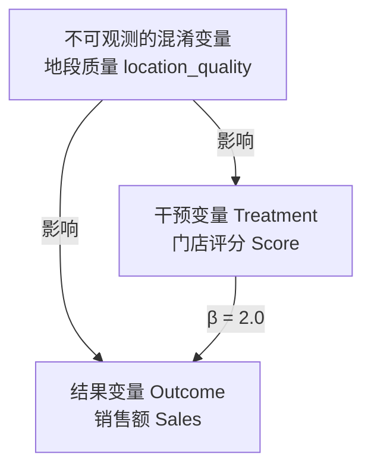
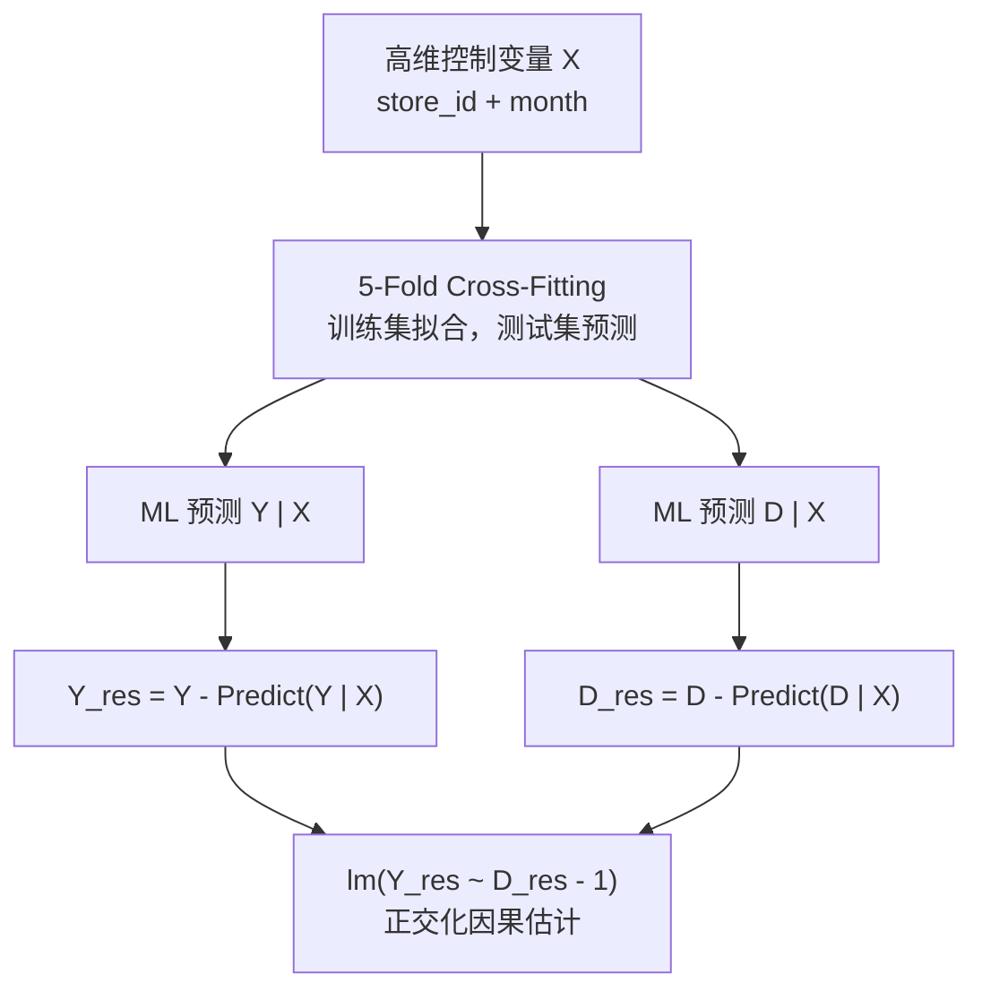

在实体零售与 O2O 业务中，“提升门店评分（Score）能否真正带来销售额（Sales）的增长？” 是一个经典的商业决策难题。如果直接建立线性回归模型，往往会严重高估评分的作用，导致营销预算的巨大浪费。

> 
> 本文以从简单的 OLS 回归开始，经历面板固定效应（Fixed Effects）、高维正则化陷阱（Lasso Bias），最终引入现代因果推断的前沿利器——双重机器学习（Double Machine Learning, DML），并延伸至非线性剂量-响应（Dose-Response）曲线的业务实战。

---

## 问题背景和数据生成过程

在探讨方法之前，我们先还原真实世界的数据生成过程（Data Generating Process, DGP）。在模拟实验中，我们设定：

- 观察样本：$N = 500$ 家门店，连续 $T = 12$ 个月，共 $6,000$ 条观测数据。
- 真理（Ground Truth）：门店评分对销售额的真实因果效应 $\beta_{true} = 2.0$。



代码：

```r
set.seed(42)
N <- 500   # 500家店
Tt <- 12   # 12个月面板
# 店铺层面、时间不变、不可观测的混淆因素：地段/品牌力
location_quality <- rnorm(N, 0, 1)
beta_true <- 2.0  # 真实因果效应：店铺分每+1，业绩真实+2
 
df <- data.frame()
for (i in 1:N) {
  base_score <- 3 + 0.8 * location_quality[i]  # 店铺分和地段正相关（混淆）
  for (t in 1:Tt) {
    score <- base_score + rnorm(1, 0, 0.3)
    noise <- rnorm(1, 0, 1)
    sales <- beta_true * score + 3 * location_quality[i] + noise
    df <- rbind(df, data.frame(store_id = i, month = t,
                                score = score, sales = sales))
  }
}
df$store_id <- factor(df$store_id)
df$month <- factor(df$month)
```

混淆陷阱：存在一个不可观测的隐性因素——门店地段质量（`location_quality`）。

1. 黄金地段的门店，顾客体验更好、曝光更多，天然容易拿到高分（`base_score = 3 + 0.8 * location_quality`）。
2. 黄金地段的门店，天然拥有庞大的基础客流，销售额更高（`sales = 2.0 * score + 3 * location_quality + noise`）。

这导致地段质量同时影响了“因”（评分）和“果”（销售额），成为了典型的混淆变量（Confounder）。

## 因果幻觉与 OLS 的陷阱

最直观的想法是直接用销售额对评分做简单线性回归（OLS）。但如果忽略了混淆变量，模型就会把“地段好带来的高销售额”错误地全部归功于“评分高”。

```r
# 截面 OLS 模型 (单月数据)
cross <- df[df$month == 1, ]
m1 <- lm(sales ~ score + store_id, data = cross)

# 全量简单 OLS 模型
m2 <- lm(sales ~ score, data = df)
round(coef(m2)["score"], 3)
# 输出: score = 5.219
```

简单 OLS 估算的系数高达 5.219，远高于真实值 2.000。

原因是出现了遗漏变量偏误（Omitted Variable Bias, OVB）。由于估计量包含 

$$ 
\text{Bias} = \gamma \cdot \frac{\text{Cov}(\text{Score}, \text{Location})}{\text{Var}(\text{Score})}
$$

导致估计结果被严重向上拉抬。

如果你据此做决策，认为“提升 1 分评分能带来 5.2 单位销售额”，以此计算得到的 ROI 将被高估 160% 以上，导致过度投入资源去补救评分，造成严重的战略失误。

## 面板固定效应（Fixed Effects, FE）

既然混淆变量（地段、品牌历史、店长基因）不可观测且难以度量，但它们在短期内是固定不变的，那么只要拥有面板数据（Panel Data），我们就可以利用每个门店自身的纵向对比（Within Transformation）抵消掉这些不随时间变化的隐性属性。

```r
library(plm)
pdata <- pdata.frame(df, index = c("store_id", "month"))
m3 <- plm(sales ~ score, data = pdata, model = "within")
summary(m3)
# 估算系数: score = 1.962 (Std. Error: 0.0449, p < 2.2e-16)
```

通过计算每个变量相对于该门店 12 个月均值的离差：

  $$
  (Y_{it} - \bar{Y}_i) = \beta (D_{it} - \bar{D}_i) + (\epsilon_{it} - \bar{\epsilon}_i)
  $$

包含地段质量 $u_i$ 的组内均值 $\bar{u}_i = u_i$，相减后被完美完全消除！

估计出的系数为 1.962，成功逼近真实值 2.0。

缺点是，这个方法强烈依赖于面板数据结构，而且当控制变量维度极高（如成千上万的时空交叉特征、用户画像维度）时，FE 模型的参数拟合效率会剧烈下降，面临“维度灾难”。

## 机器学习正则化（Lasso/ElasticNet）

为了控制高维特征（如几百家门店 Dummy、月份 Dummy），直接用普通回归会过拟合。顺理成章的想法是引入机器学习的正则化模型（如 Lasso / ElasticNet），利用 L1/L2 惩罚项自动筛选控制变量。

```r
library(glmnet)
library(Matrix)

# 构造包含门店与月份高维哑变量的稀疏矩阵
X <- sparse.model.matrix(~ score + store_id + month - 1, data = df)
y <- df$sales

# 试验 1：直接将 Treatment 与 Control 放在一起做 ElasticNet (alpha=0.5)
cv_m1 <- cv.glmnet(X, y, alpha = 0.5)
# 估算系数: score = 2.065

# 试验 2：强制对 Score 不施加惩罚 (penalty.factor)
pf <- rep(1, ncol(X))
pf[colnames(X) == "score"] <- 0
cv_m1_fixed <- cv.glmnet(X, y, alpha = 0.5, penalty.factor = pf)
# 估算系数: score = 2.070
```

虽然估算值 2.070 比 OLS 好了很多，但依然存在系统性的向上偏误。这是因为遭遇了机器学习因果推断中最经典的正则化偏差（Regularization Bias）：

1. 混淆泄漏（Confounding Leakage）：Lasso/ElasticNet 的目标是优化 $Y$ 的预测精度，而不是准确估计因果效应。为了压缩参数，算法会将一些与 $Y$ 关系较弱但对 $D$（Score）有强解释力的控制变量系数压缩为 0（即遗漏了部分混淆特征）。
2. 免除惩罚依然无效：即使通过 `penalty.factor` 保护了 $D$ 不被压缩，被部分压缩/遗漏的高维控制变量所携带的混淆影响，依然会“泄漏”回未被惩罚的 $D$ 上，导致估计量产生持续的系统性偏差。

## 双重机器学习（Double Machine Learning, DML）

要解决高维正则化带来的估计偏差，必须将干预变量的正交化与结果变量的正交化解耦。这就是 Chernozhukov 等人于 2018 年提出的 DML 框架（基于 Frisch-Waugh-Lovell 投影定理与交叉折叠 Cross-Fitting）。

DML 的核心哲学是：

> 利用机器学习剥离控制变量对 Y 和 D 的影响，只留取两者“纯粹的非关联残差”进行因果回归。

DML 架构图解与五折交叉拟合：



代码与实验：

```r
library(glmnet)

X_ctrl <- sparse.model.matrix(~ store_id + month - 1, data = df)
y <- df$sales
d <- df$score

set.seed(42)
folds <- sample(rep(1:5, length.out = nrow(df)))
y_res <- numeric(nrow(df))
d_res <- numeric(nrow(df))

for (k in 1:5) {
  idx_train <- folds != k
  idx_test  <- folds == k
  
  # Step A: 拟合 Y ~ Controls，计算 Out-of-sample 残差 (剥离 X 对 Y 的影响)
  fit_y <- cv.glmnet(X_ctrl[idx_train, ], y[idx_train], alpha = 0.5)
  y_res[idx_test] <- y[idx_test] - predict(fit_y, X_ctrl[idx_test, ], s = "lambda.min")
  
  # Step B: 拟合 D ~ Controls，计算 Out-of-sample 残差 (剥离 X 对 D 的影响)
  fit_d <- cv.glmnet(X_ctrl[idx_train, ], d[idx_train], alpha = 0.5)
  d_res[idx_test] <- d[idx_test] - predict(fit_d, X_ctrl[idx_test, ], s = "lambda.min")
}

# Step C: 残差回归（正交化估计）
dml_fit <- lm(y_res ~ d_res - 1)
summary(dml_fit)
# 估算系数: d_res = 1.963 (Std. Error: 0.0428, p < 2.2e-16)
```

为什么 DML 能够完美复原真理？

1. 外生正交性（Neyman Orthogonality）：DML 通过对 $Y$ 和 $D$ 分别建立预测模型并提取残差，消除了参数估计误差对因果系数的一阶影响（First-order sensitivity），使得因果估计量对第一阶段 ML 模型的收敛速率不敏感。
2. 样本外交叉折叠（Cross-Fitting）：在估计残差时，使用训练集拟合 ML 模型，并在测试集上计算样本外残差。这彻底阻断了由于同一个样本既参与特征选择又参与因果估计所导致的过拟合（Overfitting）偏差。
3. 结果：DML 估计出的系数为 1.963（标准误仅 0.0428），成功在高维控制变量下完美还原了真实的因果效应！

## 非线性剂量-响应曲线（Dose-Response）

在实际业务场景中，“评分每提升 1 分，销售额增加 2” 这一线性假设可能过于理想化。

- 从 3.0 分提升到 3.5 分，与从 4.5 分提升到 5.0 分，其业务边际收益是否一致？
- 业务运营需要知道非线性的边际递增/递减点（Dose-Response Effect），以制定差异化的资源分配策略。

我们将连续的评分按分位数切分为 4 组（G1: 0-25%, G2: 25-50%, G3: 50-75%, G4: 75-100%），构造多处理变量（Multi-Treatment）的 DML 模型：

```r
library(glmnet)
library(Matrix)

# 1. 离散化分组 (分位数)
quantiles <- quantile(df$score, probs = seq(0, 1, by = 0.25))
df$score_group <- cut(df$score, breaks = quantiles, include.lowest = TRUE, labels = FALSE)

# 2. 构造基准组 (G1) 的哑变量矩阵 (G2, G3, G4)
D_mat <- model.matrix(~ factor(score_group), data = df)[, -1]
colnames(D_mat) <- paste0("score_vs_g1_g", 2:4)

X_ctrl <- sparse.model.matrix(~ store_id + month - 1, data = df)
y <- df$sales

set.seed(42)
folds <- sample(rep(1:5, length.out = nrow(df)))
y_res <- numeric(nrow(df))
D_res <- matrix(0, nrow = nrow(df), ncol = ncol(D_mat))

# 3. 多维度残差化 DML
for (k in 1:5) {
  idx_train <- folds != k
  idx_test  <- folds == k
  
  fit_y <- cv.glmnet(X_ctrl[idx_train, ], y[idx_train], alpha = 0.5)
  y_res[idx_test] <- y[idx_test] - predict(fit_y, X_ctrl[idx_test, ], s = "lambda.min")
  
  for (j in 1:ncol(D_mat)) {
    fit_d <- cv.glmnet(X_ctrl[idx_train, ], D_mat[idx_train, j], alpha = 0.5)
    D_res[idx_test, j] <- D_mat[idx_test, j] - predict(fit_d, X_ctrl[idx_test, j], s = "lambda.min")
  }
}

dml_multi_fit <- lm(y_res ~ D_res - 1)
summary(dml_multi_fit)
```

结果与业务决策建议

```
Coefficients:
       Estimate Std. Error t value Pr(>|t|)    
D_res1  0.82970    0.05483   15.13   <2e-16 ***  (G2 vs G1)
D_res2  1.64692    0.06640   24.80   <2e-16 ***  (G3 vs G1)
D_res3  2.59727    0.08410   30.88   <2e-16 ***  (G4 vs G1)
```

边际效应分解：

- G1 $\to$ G2 (提升至前 25%-50%)：销售额相对净增 +0.830
- G2 $\to$ G3 (提升至前 50%-75%)：边际净增 1.647 - 0.830 = +0.817
- G3 $\to$ G4 (提升至前 75%-100%)：边际净增 2.597 - 1.647 = +0.950

业务实战指导：

1. 确定 ROI 门槛：结合各分段的提升成本，计算净边际收益（Marginal Revenue - Marginal Cost）。
2. 精细化运营：若将低分门店提升到 G2 的成本远低于将高分门店提升到 G4 的成本，则应优先救助低分门店，而非追求极致的高分。

## 全流程方法论对比与选型指南

下表汇总了本代码演进过程中各方法的表现与适用场景：

| 模型/方法 | R 代码核心实现 | 估计系数 | 实用场景与局限 |
| :--- | :--- | :--- | :--- |
| Ground Truth |    | 2.000 | 基准参照 |
| 简单截面 OLS | `lm(sales ~ score)` | 5.219 | 混淆变量未控制，不可用于决策 |
| 面板固定效应 | `plm(..., "within")` | 1.962 | 适合低维、控制变量不随时间变化的数据 |
| ElasticNet | `cv.glmnet()` | 2.070 |  存在正则化偏误，不可直接提取因果系数 |
| 连续型 DML | `DML` + 五折交叉折叠 | 1.963 | 现代工业界标准，支持高维特征控制 |
| 非线性 DML | 离散化 + 矩阵 DML | 0.83/1.65/2.60 |  评估剂量-响应曲线，指导运营边际预算分配 |

当然看官们也注意到了 ElasticNet 模型的系数为非常接近事实。如果想快速通过业务特征筛选、提炼主要业务 Baseline 信号，而且能容忍极轻微估计偏差的场景下，这是性价比极高的工业级解法。

## 总结

以上代码的演进过程，本质上是因果推断在实践中的缩影：

1. 永远不要直接相信简单回归的系数：混淆变量是因果推断最大的敌人，忽略混淆变量会导致极其严重的假性相关。
2. 区分预测与因果：ElasticNet、XGBoost 等传统机器学习算法是为预测 $Y$ 优化的，直接使用它们的系数必然受到正则化与过拟合偏差的干扰。
3. 拥抱正交化思想（DML）：DML 通过将机器学习用于预测“残差”，巧妙地把因果估计与高维特征剥离开来，是现代数据科学在复杂业务环境下进行因果估计的黄金标准。
